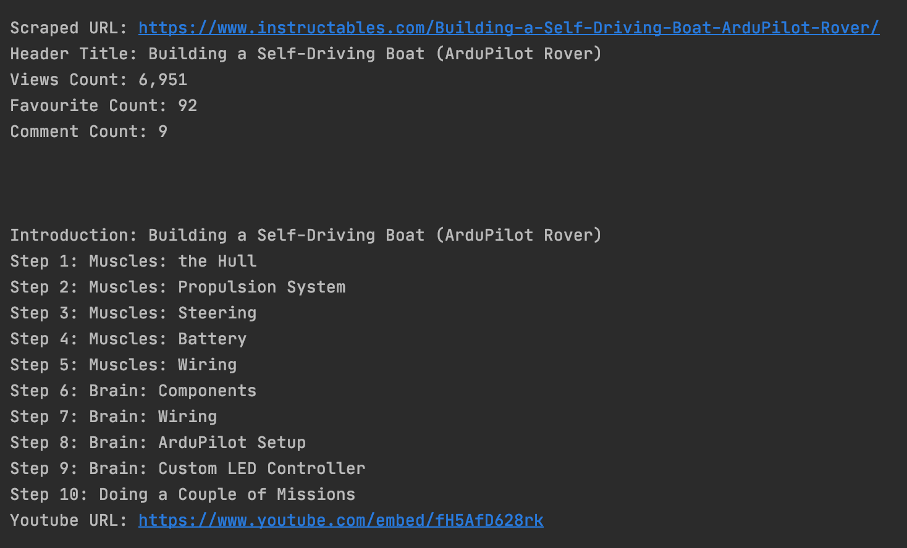
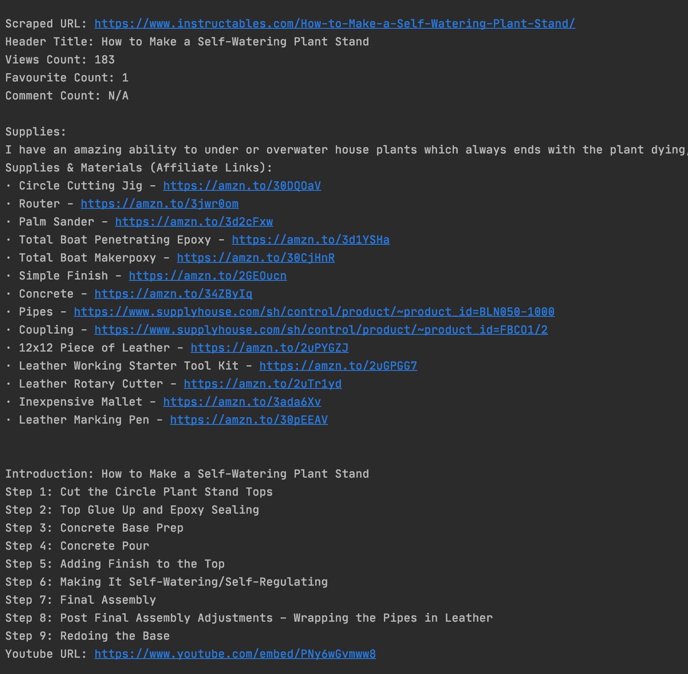
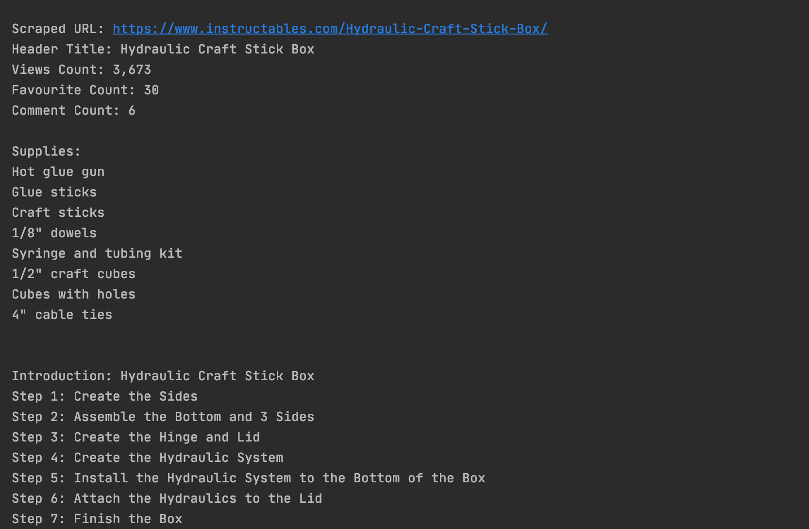

## WebScraping Assignment
This was built using ***BeautifulSoup, Selenium, PhantomJS***  

---
**Instructions:**

- Download <a href="https://phantomjs.org/download.html">PhantomJS</a> 
- Add it in the same directory where main.py is located 
- Run

---
**Features:**

- Works on both Windows and MacOS
- Only accepts URLs from instructables.com

---
**Attributes extracted from the URL:**
- Scraped URL
- Header Title
- Views Count
- Favorites Count
- Comment Count

- Supplies (If available)
- Steps Titles
- Youtube Video URL
---
**Tested on URLs:**
1. https://www.instructables.com/Building-a-Self-Driving-Boat-ArduPilot-Rover/
2. https://www.instructables.com/Hydraulic-Craft-Stick-Box/
3. https://www.instructables.com/How-to-Make-a-Self-Watering-Plant-Stand/
---
**Result ScreenShots:**  

